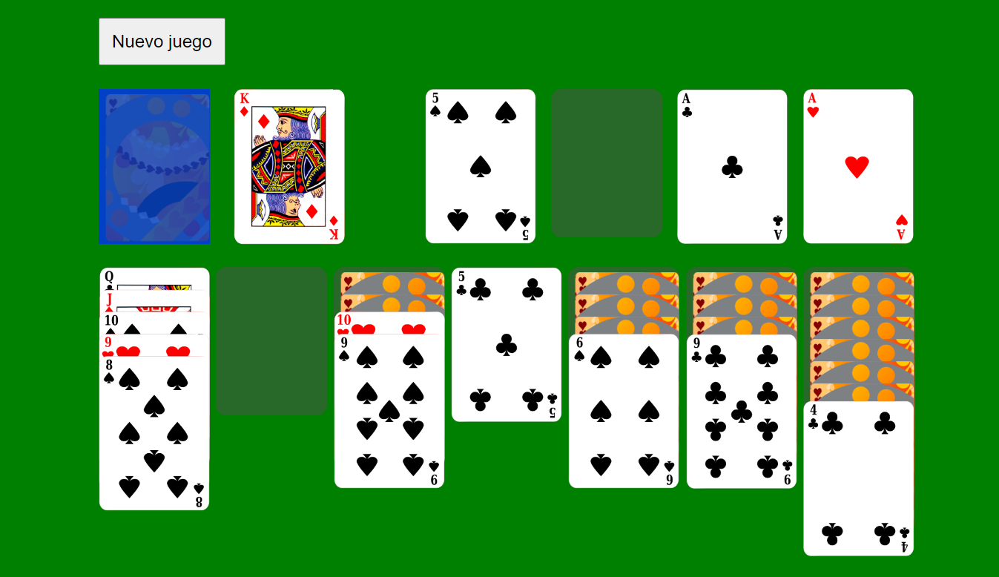

# Solitario_React

# Solitario en React con Arrastrar y Soltar (Drag and Drop)

Bienvenido al juego de Solitario desarrollado en React con la emocionante característica de arrastrar y soltar. Este proyecto ofrece una experiencia clásica de solitario directamente en tu navegador.



## Demo

Puedes probar el juego en vivo [aquí](https://solitario-react.vercel.app/).

## Características

- Implementado en React para una experiencia de usuario interactiva.
- Utiliza useContext y custom hooks para gestionar el estado del juego.
- Reglas de juego clásicas de solitario.
- Funcionalidad de arrastrar y soltar para una jugabilidad intuitiva.
- Interfaz de usuario moderna y fácil de usar.

## Instalación

1. Clona este repositorio en tu máquina local:

   ```bash
   git clone https://github.com/tu-usuario/solitario-en-react.git
   ```

2. Navega al directorio del proyecto:
   ```bash
   cd solitario-en-react
   ```
3. Instala las dependencias:

   ```bash
   cd solitario-en-react
   ```

4. Inicia la aplicación:

   ```bash
   npm start
   ```

5. Abre tu navegador y accede a http://localhost:3000 para jugar al solitario con la funcionalidad de arrastrar y soltar.

## Uso

Arrastra las cartas y suéltalas en las ubicaciones deseadas para moverlas.
El objetivo es ordenar todas las cartas por palo y número en las cuatro pilas de base.
